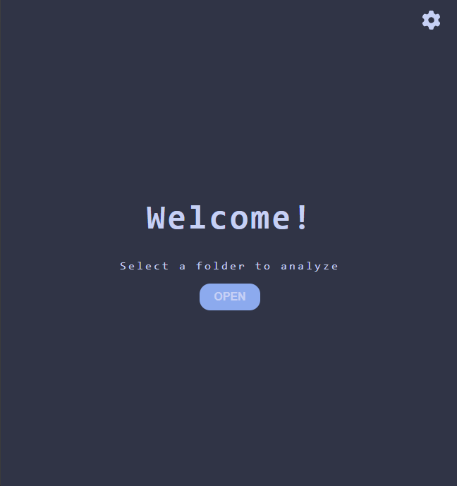
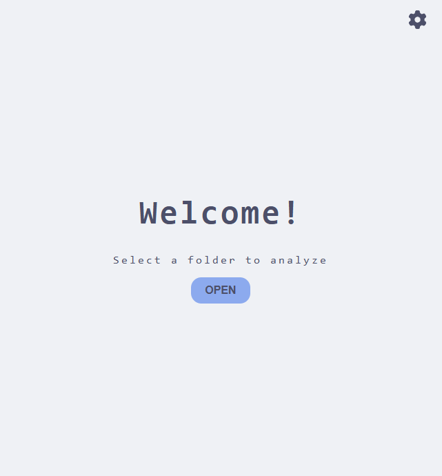
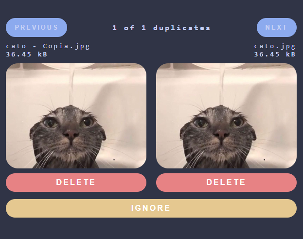

# 🖼️ Analyzer

Analyzer è un applicazione per l'analisi e la gestione di file multimediali, con funzioni avanzate di confronto
immagini/video e un'interfaccia personalizzabile.

## 🚀 Funzionalità principali
- 🔍 **Analisi di similarità** per immagini e video
- 🎛️ **Impostazioni personalizzabili** con selettori di tema e colori
- 📁 **Gestione file** con opzione di eliminazione rapida
- 📜 **Interfaccia scorrevole** con miglioramenti alla UI/UX
- 💻 **Multipiattaforma** tra Windows/Linux

---

## 📸 Screenshot




---

## Download e utilizzo
### Linux
```bash
paru -S analyzer
```
### Windows
Installa l'ultima versione dell'applicazione [qui](0.1)
## 🔧 Build e contribuire

### 1️⃣ **Clonare il repository**
```bash
git clone https://github.com/CHXSER/analyzer.git
cd analyzer
```
### 2️⃣ **Installare dipendenze**
Analyzer utilizza Rust, di conseguenza hai bisogno di avere rust installato per la tua piattaforma. Avrai anche bisogno di installare gli strumenti di Dioxus che trovi [qui](https://dioxuslabs.com/learn/0.6/getting_started/#)
#### Effettua build del programma
```bash
dx serve
```
o
```bash
dx serve --release
```

Su Linux avrai bisogno di installare le seguenti:
```bash
pacman -S 
```

